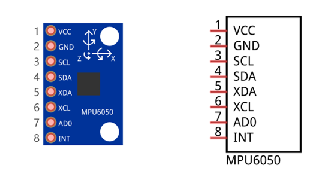

##############################################################################
Chapter Acceleration sensor
##############################################################################

In the previous chapter, we have learned sensors that are used to detect light or temperature. Now we will learn a sensor that can detect acceleration.

Project Acceleration Detection
*********************************************

We will use serial port to get the data of MPU6050 module.

Component List
================================

+------------------------------------------------------+
| Control board x1                                     |
|                                                      |
| |Chapter01_00|                                       |
+--------------------------+---------------------------+
| Breadboard x1            | GPIO Extension Board x1   |
|                          |                           |
| |Chapter02_00|           | |Chapter02_01|            |
+------------------+-------+---------------------------+
| USB cable x1     | Jumper M/M x4                     |
|                  |                                   |
| |Chapter01_02|   | |Chapter01_03|                    |
+------------------+-----------------------------------+
| Joystick x1                                          |
|                                                      |
| |Chapter17_00|                                       |
+------------------------------------------------------+

.. |Chapter01_00| image:: ../_static/imgs/1_LED_Blink/Chapter01_00.png
.. |Chapter01_02| image:: ../_static/imgs/1_LED_Blink/Chapter01_02.png
.. |Chapter01_03| image:: ../_static/imgs/1_LED_Blink/Chapter01_03.png
.. |Chapter02_00| image:: ../_static/imgs/2_Two_LEDs_Blink/Chapter02_00.png
.. |Chapter02_01| image:: ../_static/imgs/2_Two_LEDs_Blink/Chapter02_01.png
.. |Chapter17_00| image:: ../_static/imgs/17_Acceleration_sensor/Chapter17_00.png 

Component Knowledge
==================================

I2C communication
-----------------------------

I2C (Inter-Integrated Circuit) is a two-wire serial communication mode, which can be used to the connection of micro controller and its peripheral equipment. Devices using I2C communication must be connected to the serial data (SDA) line, and serial clock (SCL) line (called I2C bus). Each device has a unique address and can be used as a transmitter or receiver to communicate with devices connected to the bus.

MPU6050
-----------------------------

MPU6050 Sensor Module is a complete 6-axis Motion Tracking Device. It combines a 3-axis Gyroscope, a 3-axis Accelerometer and a DMP (Digital Motion Processor) all in a small package. The settings of the Accelerometer and Gyroscope of MPU6050 can be changed. A precision wide range digital temperature sensor is also integrated to compensate data readings for changes in temperature, and temperature values can also be read. The MPU6050 Module follows the I2C communication protocol and the default address is 0x68.

The port description of the MPU6050 module is as follows:

+----------+------------+-------------------------------------------------------------+
| Pin name | Pin number | Description                                                 |
+----------+------------+-------------------------------------------------------------+
| VCC      | 1          | Positive pole of power supply with voltage 5V               |
+----------+------------+-------------------------------------------------------------+
| GND      | 2          | Negative pole of power supply                               |
+----------+------------+-------------------------------------------------------------+
| SCL      | 3          | I2C communication clock pin                                 |
+----------+------------+-------------------------------------------------------------+
| SDA      | 4          | I2C communication data pin                                  |
+----------+------------+-------------------------------------------------------------+
| XDA      | 5          | I2C host data pin which can be connected to other devices.  |
+----------+------------+-------------------------------------------------------------+
| XCL      | 6          | I2C host clock pin which can be connected to other devices. |
+----------+------------+-------------------------------------------------------------+
|          |            | I2C address bit control pin.                                |
|          |            |                                                             |
| AD0      | 7          | Low level: the device address is 0x68                       |
|          |            |                                                             |
|          |            | High level: the device address is 0x69                      |
+----------+------------+-------------------------------------------------------------+
| INT      | 8          | Output interrupt pin                                        |
+----------+------------+-------------------------------------------------------------+

For more detail, please refer to datasheet.

MPU6050 is widely used to assist with balancing vehicles, robots and aircraft, mobile phones and other products which require stability to control stability and attitude or which need to sense same.

Circuit
============================

Use pin A4/SDA, pin A5/SCL port on the control board to communicate with MPU6050 module.

.. list-table:: 
   :width: 100%
   :align: center

   * -  Schematic diagram
   * -  |Chapter17_02|
   * -  Hardware connection 
     
        If you need any support, please feel free to contact us via: support@freenove.com

   * -  |Chapter17_03|

.. |Chapter17_03| image:: ../_static/imgs/17_Acceleration_sensor/Chapter17_03.png

Sketch
==========================

Sketch Acceleration_Detection
---------------------------

Library is a collection of code. We can use code provided by libraries to make programming simple.

Click "Add .ZIP Library..." and then find Adafruit_MPU6050.zip in libraries folder (this folder is in the folder unzipped form the ZIP file we provided). These libraries make it easy to use MPU6050 module. 

When these libraries are added, you can locate them in the libraries under Sketchbook location in the File-Preferences window. You can view the source code of these library files to understand their specific usage.

Or, you can search Adafruit_MPU6050 on library manager to install.

Now write sketch to communicate with the MPU6050 module and send the collected data to Serial Monitor window.

.. literalinclude:: ../../../freenove_Kit/Sketches/Sketch_17.1.1_Acceleration_Detection/Sketch_17.1.1_Acceleration_Detection.ino
    :linenos: 
    :language: c
    :lines: 1-71
    :dedent:

Include the necessary libraries.

.. literalinclude:: ../../../freenove_Kit/Sketches/Sketch_17.1.1_Acceleration_Detection/Sketch_17.1.1_Acceleration_Detection.ino
    :linenos: 
    :language: c
    :lines: 9-11
    :dedent:

Initialize the sensor object. The Adafruit_MPU6050 library provides the Adafruit_MPU6050 class to operate the MPU6050. Before using it, you need to instantiate an object of the class. 

.. literalinclude:: ../../../freenove_Kit/Sketches/Sketch_17.1.1_Acceleration_Detection/Sketch_17.1.1_Acceleration_Detection.ino
    :linenos: 
    :language: c
    :lines: 14-14
    :dedent:

Initialize serial communication and call the function to initialize the MPU6050 sensor.

.. literalinclude:: ../../../freenove_Kit/Sketches/Sketch_17.1.1_Acceleration_Detection/Sketch_17.1.1_Acceleration_Detection.ino
    :linenos: 
    :language: c
    :lines: 18-25
    :dedent:

After successfully connecting to the MPU6050, set the range for the accelerometer and gyroscope, and configure the filter bandwidth.

.. literalinclude:: ../../../freenove_Kit/Sketches/Sketch_17.1.1_Acceleration_Detection/Sketch_17.1.1_Acceleration_Detection.ino
    :linenos: 
    :language: c
    :lines: 28-34
    :dedent:

Read acceleration, gyroscope, and temperature data from the MPU6050 and print them to the serial monitor.

.. literalinclude:: ../../../freenove_Kit/Sketches/Sketch_17.1.1_Acceleration_Detection/Sketch_17.1.1_Acceleration_Detection.ino
    :linenos: 
    :language: c
    :lines: 38-71
    :dedent:

Verify and upload the code, open the Serial Monitor, then you can see the value of MPU6050 in original state and converted state, which is sent from control board. Rotate and move the MPU6050 module, and then you can see the change of values.

Data sent by this code may be too much for the users not familiar with acceleration. You can choose to upload sketch 17.1.2, which only send three direction acceleration values to the serial port. And it will be relatively easy to observe change of numbers, when you rotate and move this module,