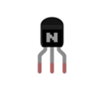
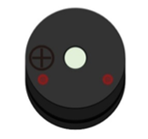
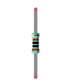
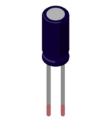
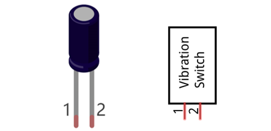
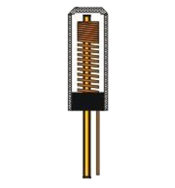
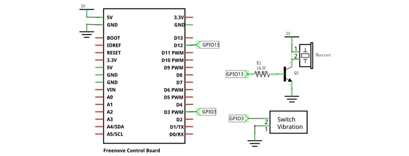
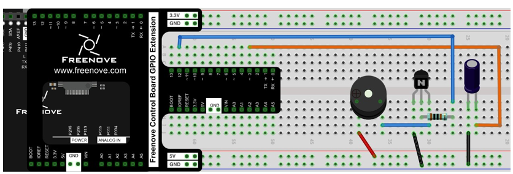

##############################################################################
Chapter Vibration Switch
##############################################################################

Vibration switch is a component that can detect vibration. We will use this sensor later.

Project Detect Vibration
*************************************

Now let us try to use vibration switch to detect vibration.

Component List
==============================

+-----------------------------------------------------------------------------+
| Control board x1                                                            |
|                                                                             |
| |Chapter01_00|                                                              |
+--------------------------+--------------------------------------------------+
| Breadboard x1            | GPIO Extension Board x1                          |
|                          |                                                  |
| |Chapter02_00|           | |Chapter02_01|                                   |
+------------------+-------+--------------------------------------------------+
| USB cable x1     | Jumper M/M x15                                           |
|                  |                                                          |
| |Chapter01_02|   | |Chapter01_03|                                           |
+------------------+-------+--------------------------------------------------+
| NPN transistorx1         | Active buzzer x1                                 |
|                          |                                                  |
| |Chapter24_00|           | |Chapter24_01|                                   |
+--------------------------+--------------------------------------------------+
| Resistor 1kΩ x1          | Vibration switch x1                              |
|                          |                                                  |
| |Chapter24_02|           | |Chapter24_03|                                   |
+--------------------------+--------------------------------------------------+

.. |Chapter01_00| image:: ../_static/imgs/1_LED_Blink/Chapter01_00.png
.. |Chapter01_02| image:: ../_static/imgs/1_LED_Blink/Chapter01_02.png
.. |Chapter01_03| image:: ../_static/imgs/1_LED_Blink/Chapter01_03.png
.. |Chapter02_00| image:: ../_static/imgs/2_Two_LEDs_Blink/Chapter02_00.png
.. |Chapter02_01| image:: ../_static/imgs/2_Two_LEDs_Blink/Chapter02_01.png

Component Knowledge
===============================

Vibration Switch
-------------------------------

Vibration switches is a kind of sensor that can detect vibration. When the vibration amplitude is greater than the critical value, two pins of the vibration switch will be switched on.

The internal circuit of the Vibration switch is as below, one of the pins is connected with a metal bar and the other is connected with spring. The spring will swing when a vibration occurs. When the vibration is strong enough, the spring will contact with the metal bar to make the two pins connected with each other.

Circuit Knowledge
===================================

Digital pins with interrupts
-----------------------------------

Some of the control board digital pins can be configured to interrupt mode, which can trigger interrupt event and execute interrupt function.

Pin 2 and 3 of the control board can be configured to interrupt mode. Conditions that trigger interrupt can be configured to:

+-----------+---------------------------------------------------------+
| Condition | Function                                                |
+-----------+---------------------------------------------------------+
| LOW       | to trigger the interrupt whenever the pin is low        |
+-----------+---------------------------------------------------------+
| CHANGE    | to trigger the interrupt whenever the pin changes value |
+-----------+---------------------------------------------------------+
| RISING    | to trigger when the pin goes from low to high           |
+-----------+---------------------------------------------------------+
| FALLING   | to trigger for when the pin goes from high to low       |
+-----------+---------------------------------------------------------+

Interrupts are useful for making things happen automatically in microcontroller programs, and they can help solve timing problems. Ideal tasks for using an interrupt may include reading a rotary encoder, or monitoring user input.

Circuit
=============================

Use pin 3 on the control board to connect vibration switch, and pin 13 to drive buzzer.

.. list-table:: 
   :width: 100%
   :align: center

   * -  Schematic diagram
   * -  |Chapter24_06|
   * -  Hardware connection 
     
        If you need any support, please feel free to contact us via: support@freenove.com

   * -  |Chapter24_07|

Sketch
============================

Sketch Detect_Vibration
----------------------------

Now write code to detect whether the vibration switch is conducted and whether it makes a buzzer sound when conducted.

.. literalinclude:: ../../../freenove_Kit/Sketches/Sketch_24.1.1_Detect_Vibration/Sketch_24.1.1_Detect_Vibration.ino
    :linenos: 
    :language: c
    :lines: 1-32
    :dedent:

This code configures the pin that is connected to vibration switch to be triggered by falling edge, that is, FALLING mode.

.. literalinclude:: ../../../freenove_Kit/Sketches/Sketch_24.1.1_Detect_Vibration/Sketch_24.1.1_Detect_Vibration.ino
    :linenos: 
    :language: c
    :lines: 17-17
    :dedent:

.. py:function:: attachInterrupt(interrupt, ISR, mode);
    
    This function is used to configure the digital pin's interrupt mode. Each parameter of the function is as follows:
    
        interrupt: the number of the interrupt (int). Normally you should use digitalPinToInterrupt(pin) to translate the actual digital pin to the specific interrupt number.
    
        ISR: the ISR to be called when an interrupt occurs; this function must take no parameters and return nothing. This function is sometimes referred to as an interrupt service routine.
    
        mode: defines when the interrupt should be triggered.

And we configure the pins that connected with vibration switch into pull up input mode. This way can ensure a high level of vibration switch when not connected, and low level when connected. So it can cause interrupt.

.. literalinclude:: ../../../freenove_Kit/Sketches/Sketch_24.1.1_Detect_Vibration/Sketch_24.1.1_Detect_Vibration.ino
    :linenos: 
    :language: c
    :lines: 15-15
    :dedent:

The following is the interrupt function, and it will be executed when the interrupt is triggered.

.. literalinclude:: ../../../freenove_Kit/Sketches/Sketch_24.1.1_Detect_Vibration/Sketch_24.1.1_Detect_Vibration.ino
    :linenos: 
    :language: c
    :lines: 30-32
    :dedent:

Interrupt function should keep short, so we use a variable "isVibrate" to record whether the interrupt is triggered, and dispose it in the loop() function. And the buzzer will be connected if the interrupt is triggered.

.. literalinclude:: ../../../freenove_Kit/Sketches/Sketch_24.1.1_Detect_Vibration/Sketch_24.1.1_Detect_Vibration.ino
    :linenos: 
    :language: c
    :lines: 21-27
    :dedent:

Verify and upload the code and tap on the vibration switch, and then the buzzer will make a sound.