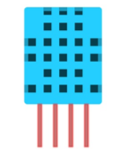
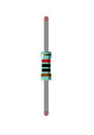
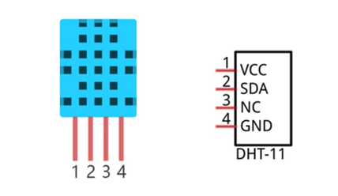
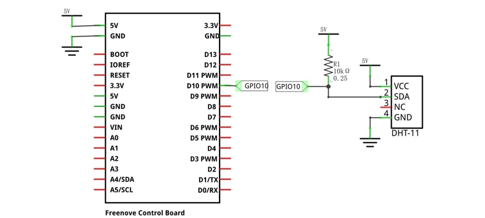
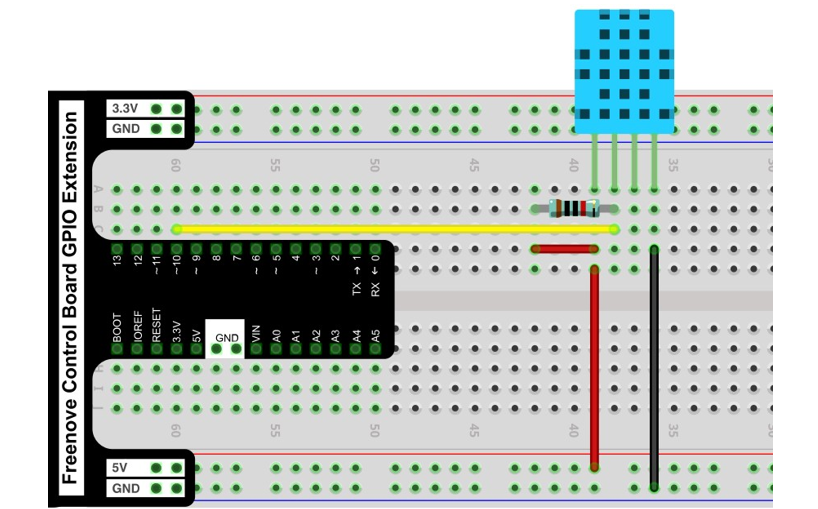
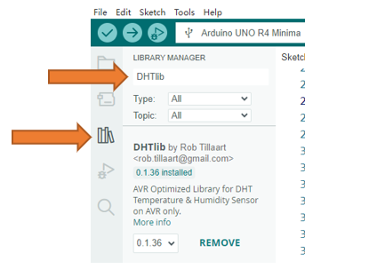
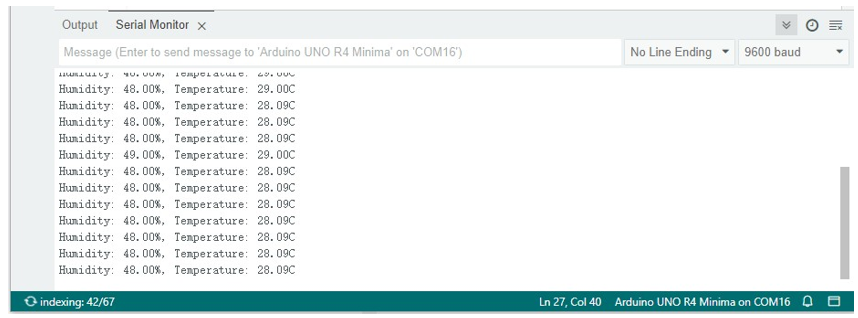

##############################################################################
Chapter Temperature & Humidity Sensor
##############################################################################

In this chapter, we will learn how to use a sensor that can detect temperature and humidity.

Project Temperature & Humidity Sensor
***************************************************

Now, let's try to get the temperature and humidity value of the current environment.

+------------------------------------------------------+
| Control board x1                                     |
|                                                      |
| |Chapter01_00|                                       |
+--------------------------+---------------------------+
| Breadboard x1            | GPIO Extension Board x1   |
|                          |                           |
| |Chapter02_00|           | |Chapter02_01|            |
+------------------+-------+---------------------------+
| USB cable x1     | Jumper M/M x8                     |
|                  |                                   |
| |Chapter01_02|   | |Chapter01_03|                    |
+------------------+------+----------------------------+
| Resistor 10kΩ x1        | DHT11 x1                   |
|                         |                            |
| |Chapter26_01|          |  |Chapter26_00|            |
+-------------------------+----------------------------+

.. |Chapter01_00| image:: ../_static/imgs/1_LED_Blink/Chapter01_00.png
.. |Chapter01_02| image:: ../_static/imgs/1_LED_Blink/Chapter01_02.png
.. |Chapter01_03| image:: ../_static/imgs/1_LED_Blink/Chapter01_03.png
.. |Chapter02_00| image:: ../_static/imgs/2_Two_LEDs_Blink/Chapter02_00.png
.. |Chapter02_01| image:: ../_static/imgs/2_Two_LEDs_Blink/Chapter02_01.png

Component Knowledge
==========================

DHT11
-------------------------

The Temperature & Humidity Sensor DHT11 is a compound temperature & humidity sensor, and the output digital signal has been calibrated by its manufacturer.

DHT11 uses customized single-line communication protocol, so we can use the library to read data more conveniently.

Circuit
==========================

Use pin 10 on control board to connect DHT11.

.. list-table:: 
   :width: 100%
   :align: center

   * -  Schematic diagram
   * -  |Chapter26_03|
   * -  Hardware connection 
     
        If you need any support, please feel free to contact us via: support@freenove.com

   * -  |Chapter26_04|

Sketch
=========================

Sketch Temperature_&_Humidity_Sensor
-------------------------

This code uses a library named "DHTlib", if you have not installed it, please do so first.

Library is an important feature of the open source world, and we know that Arduino is an open source platform

that everyone can contribute to.

How to install the library
-----------------------------

There are two ways to add libraries.

you can search "DHTlib" in library manager to install.

The second way, Click "Add .ZIP Library..." and then find DHT.zip in libraries folder (this folder is in the folder unzipped from the ZIP file we provided). This library can make it convenient for us to control DHT11.

Now, write code to get the temperature and humidity data measured by DHT11, and sent it to the serial port.

.. literalinclude:: ../../../freenove_Kit/Sketches/Sketch_26.1.1_Temperature_and_Humidity_Sensor/Sketch_26.1.1_Temperature_and_Humidity_Sensor.ino
    :linenos: 
    :language: c
    :lines: 1-41
    :dedent:

In the code, we use the dht class provided by the DHT library to control DHT11. The following is a DHT object. As shown below, instantiate one dht object.

.. literalinclude:: ../../../freenove_Kit/Sketches/Sketch_26.1.1_Temperature_and_Humidity_Sensor/Sketch_26.1.1_Temperature_and_Humidity_Sensor.ino
    :linenos: 
    :language: c
    :lines: 10-10
    :dedent:

Read DHT11 data and send the result to the serial port in the loop() function.

.. code-block:: c

    // read DHT11 and judge the state according to the return value
    int chk = DHT.read11(dhtPin);
    switch (chk)
    {
        case DHTLIB_OK: // When read data successfully print temperature and humidity data
        Serial.print("Humidity: ");
        Serial.print(DHT.humidity);
        Serial.print("%, Temperature: ");
        Serial.print(DHT.temperature);
        Serial.println("C");
        break;
        ......
    }

Send the failure reason when fail to read.

.. literalinclude:: ../../../freenove_Kit/Sketches/Sketch_26.1.1_Temperature_and_Humidity_Sensor/Sketch_26.1.1_Temperature_and_Humidity_Sensor.ino
    :linenos: 
    :language: c
    :lines: 30-38
    :dedent:

Verify and upload the code, open the Serial Monitor, and then you will see the temperature and humidity data being sent from control board.

