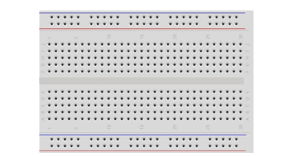

##############################################################################
Chapter Infrared Motion Sensor
##############################################################################

Infrared Motion Sensor is an integrated sensor that can sense the motion of the human body. Now let us try to use it.

Project Infrared Motion Sensor
***********************************************

Now, we'll use Infrared Motion Sensor to detect human motion.

Component List
===============================

+------------------------------------------------------+
| Control board x1                                     |
|                                                      |
| |Chapter01_00|                                       |
+--------------------------+---------------------------+
| Breadboard x1            | GPIO Extension Board x1   |
|                          |                           |
| |Chapter02_00|           | |Chapter02_01|            |
+------------------+-------+---------------------------+
| USB cable x1     | Jumper M/M x8                     |
|                  |                                   |
| |Chapter01_02|   | |Chapter01_03|                    |
+------------------+-----------------------------------+
| Infrared motion sensor x1                            |
|                                                      |
| |Chapter27_00|                                       |
+------------------------------------------------------+

.. |Chapter01_00| image:: ../_static/imgs/1_LED_Blink/Chapter01_00.png
.. |Chapter01_02| image:: ../_static/imgs/1_LED_Blink/Chapter01_02.png
.. |Chapter01_03| image:: ../_static/imgs/1_LED_Blink/Chapter01_03.png

.. |Chapter02_01| image:: ../_static/imgs/2_Two_LEDs_Blink/Chapter02_01.png

Component Knowledge
================================

Infrared Motion Sensor
---------------------------------

Infrared Motion Sensor is an integrated sensor that can sense the motion of a human body. It can detect whether someone is moving in the sensing range by detecting the infrared light emitted by human body. Here is the HC-SR501 infrared motion sensor and its back:

Description: 

1.	Working voltage: 5v-20v(DC), static current: 65uA.

2.	Automatic trigger. When a living body enters into the active area of sensor, the module will output high level (3.3V: Though the high level of control board is 5v, 3.3v is identified as high level here). When the body leaves the sensor’s active detection area, it will output high level lasting for time period T, then output low level(0V). Delay time T can be adjusted by the potentiometer R1. 

3.	According to the position of Fresnel lenses dome, you can choose non-repeatable trigger modes or repeatable modes. 

    L: non-repeatable trigger mode. The module output high level after sensing a body, then when the delay time is over, the module will output low level. During high level time, the sensor no longer actively senses bodies.  

    H: repeatable trigger mode. The distinction from the L mode is that it can sense a body until that body leaves during the period of high level output. After this, it starts to time and output low level after delaying T time.

4.	Induction block time: the induction will stay in block condition and does not induce external signal at lesser time intervals (less than delay time) after outputting high level or low level.

5.	 Initialization time: the module needs about 1 minute to initialize after being powered ON. During this period, it will alternately output high or low level. 

6.	One characteristic of this sensor is when a body moves close to or moves away from the sensor’s dome edge, the sensor will work at high sensitively. When a body moves close to or moves away from the sensor’s dome in a vertical direction (perpendicular to the dome), the sensor cannot detect well (please take note of this deficiency). Actually this makes sense when you consider that this sensor is usually placed on a celling as part of a security product. Note: The Sensing Range (distance before a body is detected) is adjusted by the potentiometer.

We can regard this sensor as a simple inductive switch when in use.

Circuit
================================

Use pin 12 on the control board to connect out-pin of HC-SR501 infrared motion sensor.

.. list-table:: 
   :width: 100%
   :align: center

   * -  Schematic diagram
   * -  |Chapter27_02|
   * -  Hardware connection 
     
        If you need any support, please feel free to contact us via: support@freenove.com

   * -  |Chapter27_03|

Sketch
===============================

Sketch Infrared_Motion_Sensor
----------------------------

Now, write code to get the results measured by the HC-SR501 infrared motion sensor, and display that through LED.

.. literalinclude:: ../../../freenove_Kit/Sketches/Sketch_27.1.1_Infrared_Motion_Sensor/Sketch_27.1.1_Infrared_Motion_Sensor.ino
    :linenos: 
    :language: c
    :lines: 1-20
    :dedent:

This code is relatively simple. We have obtained the sensor's output signal, and control a LED according to it.

.. literalinclude:: ../../../freenove_Kit/Sketches/Sketch_27.1.1_Infrared_Motion_Sensor/Sketch_27.1.1_Infrared_Motion_Sensor.ino
    :linenos: 
    :language: c
    :lines: 18-18
    :dedent:

Verify and upload the code, put the sensor on a stationary table and wait for about a minute. And then try to get close to or away from the sensor, and observe whether the LED will be turned on or turned off automatically.

You can turn the potentiometer on the sensor to adjust the detection effect, or use different modes through changing jumper.

Apart from that, you can use this sensor to control some other modules to achieve different functions by re-editing the code, such as the induction lamp, induction door.