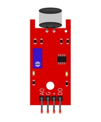
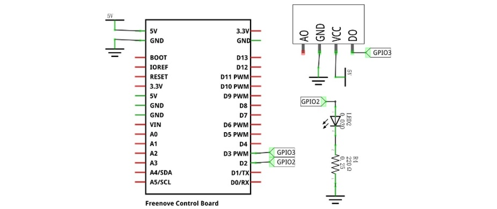
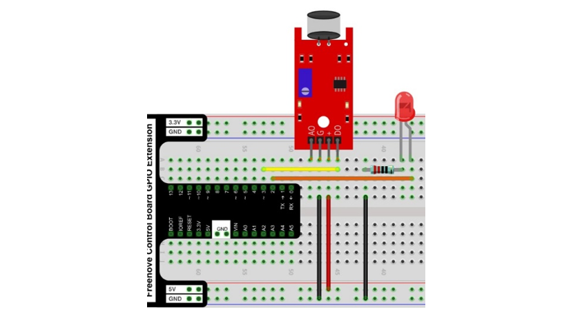

##############################################################################
Chapter High-sensitivity microphone sensor
##############################################################################

In this chapter, we will learn how to use High-sensitivity microphone sensor.

Project High-sensitivity microphone sensor and LED
****************************************************************

This project will use a high-sensitivity microphone sensor to make a sound-controlled light.

Component List
================================

+------------------------------------------------------+
| Control board x1                                     |
|                                                      |
| |Chapter01_00|                                       |
+--------------------------+---------------------------+
| Breadboard x1            | GPIO Extension Board x1   |
|                          |                           |
| |Chapter02_00|           | |Chapter02_01|            |
+------------------+-------+---------------------------+
| USB cable x1     | Jumper x5                         |
|                  |                                   |
| |Chapter01_02|   | |Chapter01_03|                    |
+------------------+-----------------------------------+
| High-sensitivity microphone sensor x1                |
|                                                      |
| |Chapter29_00|                                       |
+-------------------+----------------------------------+
| LED x1            |      Resistor 220Ω x1            |
|                   |                                  |
| |Chapter29_01|    |   |Chapter29_02|                 |
+-------------------+----------------------------------+        

.. |Chapter01_00| image:: ../_static/imgs/1_LED_Blink/Chapter01_00.png
.. |Chapter01_02| image:: ../_static/imgs/1_LED_Blink/Chapter01_02.png
.. |Chapter01_03| image:: ../_static/imgs/1_LED_Blink/Chapter01_03.png
.. |Chapter02_00| image:: ../_static/imgs/2_Two_LEDs_Blink/Chapter02_00.png
.. |Chapter02_01| image:: ../_static/imgs/2_Two_LEDs_Blink/Chapter02_01.png

.. |Chapter29_01| image:: ../_static/imgs/29_High-sensitivity_microphone_sensor/Chapter29_01.png  
.. |Chapter29_02| image:: ../_static/imgs/29_High-sensitivity_microphone_sensor/Chapter29_02.png  

Component knowledge
==========================

High-sensitivity microphone sensor
------------------------------------------

The high-sensitivity microphone sensor module is a component that accepts sound waves and converts them into electrical signals, which can detect the sound intensity in the surrounding environment. 

When using it, it should be noted that this sensor can only identify the presence or absence of sound (according to the vibration principle), but cannot identify the size of the sound or the sound of a specific frequency.

This module has 4 pins: digital output (DO), analog output (AO), power supply positive pin and power supply negative pin. AO can output the voltage signal of the microphone in real time. When the ambient sound intensity does not reach the set threshold, the DO outputs a low-level signal, and when the ambient sound intensity exceeds the set threshold, it outputs a high-level signal, and the sensitivity can be adjusted by a potentiometer. When in use, adjust the potentiometer to make the sensitivity to sound reach a more appropriate value, and then read the digital output signal of the module through a pin on the development board. You can speak to the sensor. When the sensor detects a speaking sound, the DO pin outputs a high level; when the sensor does not detect a speaking sound, the DO pin outputs a low level.

Below is the pinout of the high-sensitivity microphone sensor.

Pin description:
-------------------------------

+--------+------------------------------+
| symbol | Function                     |
+========+==============================+
| DO     | Digital signal output        |
+--------+------------------------------+
| VCC    | Power supply pin, +3.3V~5.0V |
+--------+------------------------------+
| GND    | GND                          |
+--------+------------------------------+
| AO     | Analog signal output         |
+--------+------------------------------+

Since the default sensitivity of the high-sensitivity microphone sensor is high, the two LED lights on the module are lit up after power-on, and the sensitivity should be adjusted to an appropriate value at this time. When the potentiometer is adjusted clockwise, the module identification sensitivity increases; When counterclockwise adjustment potentiometer, module recognition sensitivity decreases. Please adjust the potentiometer before using the module to make its sensitivity reach the appropriate value. Under normal circumstances, you need counterclockwise rotation of the potentiometer, so that the output of the module LED off, when the sensitivity is low can be appropriate clockwise adjustment of the potentiometer, please ensure that your sensor output LED is extinguished when energized, in order to identify the sound.

Please do not use voltage beyond the power supply range to avoid damage to the high-sensitivity microphone sensor.

Circuit
========================

.. list-table:: 
   :width: 100%
   :align: center

   * -  Schematic diagram
   * -  |Chapter29_03|
   * -  Hardware connection 
     
        If you need any support, please feel free to contact us via: support@freenove.com

   * -  |Chapter29_04|

Sketch
==========================

Sketch High_sensitivity_microphone_sensor_and_LED
-----------------------------

After the program is executed, when you speak to the sensor, the LED will turn on for 5 seconds. After 5 seconds, the LED will turn off. When the sensor does not recognize the sound, the LED will turn off.

The following is the program code:

.. literalinclude:: ../../../freenove_Kit/Sketches/Sketch_29.1.1_High_sensitivity_microphone_sensor_and_LED/Sketch_29.1.1_High_sensitivity_microphone_sensor_and_LED.ino
    :linenos: 
    :language: c
    :lines: 1-27
    :dedent:

Read the signal pin of the high-sensitivity microphone sensor, and determine whether the state of the sensor is high level. If it is high level, the LED will continue to turn on for 5 seconds.

.. literalinclude:: ../../../freenove_Kit/Sketches/Sketch_29.1.1_High_sensitivity_microphone_sensor_and_LED/Sketch_29.1.1_High_sensitivity_microphone_sensor_and_LED.ino
    :linenos: 
    :language: c
    :lines: 20-26
    :dedent: