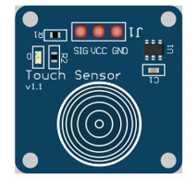
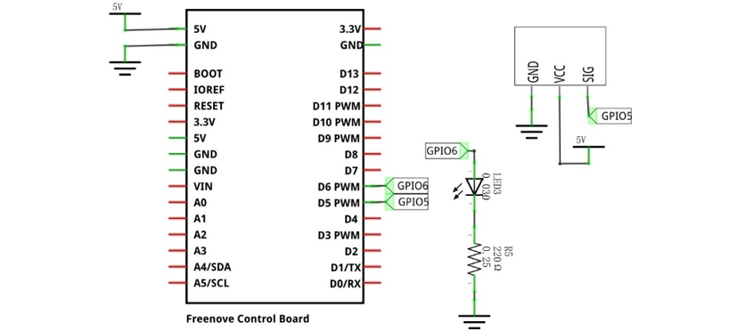
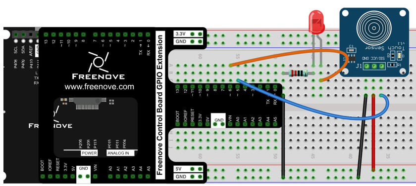
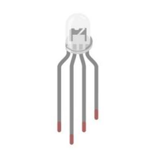
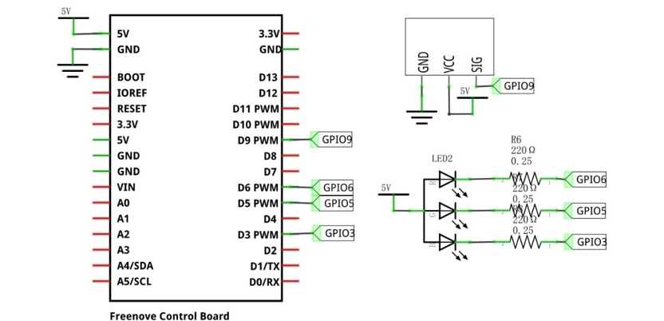
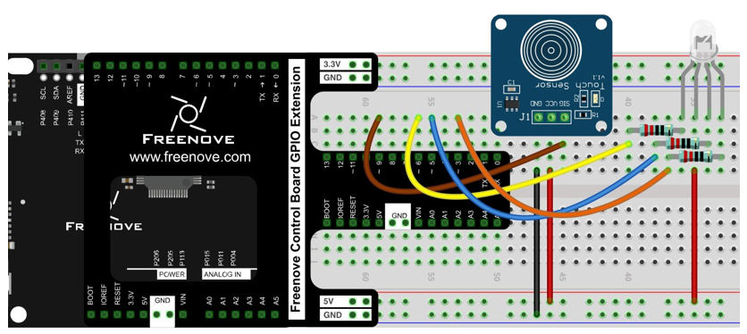

##############################################################################
Chapter Touch Sensor TTP223
##############################################################################

In this chapter, we will learn how to use the touch sensor.

Project Touch Sensor and LED
*****************************************

This project will use the touch sensor to control the LED to emit different brightness.

Component List
============================

+------------------------------------------------------+
| Control board x1                                     |
|                                                      |
| |Chapter01_00|                                       |
+--------------------------+---------------------------+
| Breadboard x1            | GPIO Extension Board x1   |
|                          |                           |
| |Chapter02_00|           | |Chapter02_01|            |
+------------------+-------+---------------------------+
| USB cable x1     | Jumper x5                         |
|                  |                                   |
| |Chapter01_02|   | |Chapter01_03|                    |
+------------------+-----------------------------------+
| TTP223 Touch Sensor x1                               |
|                                                      |
| |Chapter30_00|                                       |
+-------------------+----------------------------------+
| LED x1            |      Resistor 220Ω x1            |
|                   |                                  |
| |Chapter29_01|    |   |Chapter29_02|                 |
+-------------------+----------------------------------+        

.. |Chapter01_00| image:: ../_static/imgs/1_LED_Blink/Chapter01_00.png
.. |Chapter01_02| image:: ../_static/imgs/1_LED_Blink/Chapter01_02.png
.. |Chapter01_03| image:: ../_static/imgs/1_LED_Blink/Chapter01_03.png
.. |Chapter02_00| image:: ../_static/imgs/2_Two_LEDs_Blink/Chapter02_00.png
.. |Chapter02_01| image:: ../_static/imgs/2_Two_LEDs_Blink/Chapter02_01.png

.. |Chapter29_01| image:: ../_static/imgs/29_High-sensitivity_microphone_sensor/Chapter29_01.png  
.. |Chapter29_02| image:: ../_static/imgs/29_High-sensitivity_microphone_sensor/Chapter29_02.png  

Component knowledge
==============================

Touch Sensor
----------------------------

The touch sensor module is a capacitive touch switch module based on TTP223 chip. Its use is very simple. This module has 3 pins: signal pin, power positive pin and power negative pin. When the positive and negative pins of the module are connected to a suitable power supply, the module starts to work. At this time, only one pin on the development board is needed to read the output signal of the module. For example, you can touch the front and back of the module. When the touch sensor is touched, the signal pin outputs a high level; when the touch sensor is not touched, it outputs a low level.

Below is the pinout of the touch sensor.

+--------+------------------------------+
|  Pin   |         description:         |
+========+==============================+
| symbol | Function                     |
+--------+------------------------------+
| SIG    | Output control signal        |
+--------+------------------------------+
| VCC    | Power supply pin, +2.0V~5.5V |
+--------+------------------------------+
| GND    | GND                          |
+--------+------------------------------+

Please do not use voltage beyond the power supply range to avoid damage to the touch sensor.

Circuit
========================

.. list-table:: 
   :width: 100%
   :align: center

   * -  Schematic diagram
   * -  |Chapter30_01|
   * -  Hardware connection 
     
        If you need any support, please feel free to contact us via: support@freenove.com

   * -  |Chapter30_02|

Sketch
=========================

Sketch Touch_Sensor_and_LED
-------------------------

In this code, we use the touch sensor to adjust the brightness of the LED. Every time you touch the sensor with your hand, the brightness of the LED changes.

The following is the program code:

.. literalinclude:: ../../../freenove_Kit/Sketches/Sketch_30.1.1_Touch_Sensor_and_LED/Sketch_30.1.1_Touch_Sensor_and_LED.ino
    :linenos: 
    :language: c
    :lines: 1-52
    :dedent:

Each time the sensor is touched, a variable grade is used to record the number of touches.

.. literalinclude:: ../../../freenove_Kit/Sketches/Sketch_30.1.1_Touch_Sensor_and_LED/Sketch_30.1.1_Touch_Sensor_and_LED.ino
    :linenos: 
    :language: c
    :lines: 17-35
    :dedent:

Set the LED light to emit different brightness according to the value of grade.

.. literalinclude:: ../../../freenove_Kit/Sketches/Sketch_30.1.1_Touch_Sensor_and_LED/Sketch_30.1.1_Touch_Sensor_and_LED.ino
    :linenos: 
    :language: c
    :lines: 38-51
    :dedent:

Project Touch Sensor and RGB LED
*********************************************

This project uses a touch sensor to control RGB LED to emit different colors.

Component List
===========================

+------------------------------------------------------+
| Control board x1                                     |
|                                                      |
| |Chapter01_00|                                       |
+--------------------------+---------------------------+
| Breadboard x1            | GPIO Extension Board x1   |
|                          |                           |
| |Chapter02_00|           | |Chapter02_01|            |
+------------------+-------+---------------------------+
| USB cable x1     | Jumper x7                         |
|                  |                                   |
| |Chapter01_02|   | |Chapter01_03|                    |
+------------------+-----------------------------------+
| TTP223 Touch Sensor x1                               |
|                                                      |
| |Chapter30_00|                                       |
+-------------------+----------------------------------+
| RGB LED x1        |  Resistor 220Ω x3                |
|                   |                                  |
| |Chapter30_03|    |   |Chapter29_02|                 |
+-------------------+----------------------------------+            

Circuit
========================

.. list-table:: 
   :width: 100%
   :align: center

   * -  Schematic diagram
   * -  |Chapter30_04|
   * -  Hardware connection 
     
        If you need any support, please feel free to contact us via: support@freenove.com

   * -  |Chapter30_05|

Sketch
========================

Sketch Touch_Sensor_and_RGB_LED
------------------------

After the program is executed, we can use the touch sensor to adjust the color change of the RGB LED. Every time the sensor is touched, the color of the RGB LED changes. Color changes from red to green to blue.

The following is the program code:

.. literalinclude:: ../../../freenove_Kit/Sketches/Sketch_30.2.1_Touch_Sensor_and_RGB_LED/Sketch_30.2.1_Touch_Sensor_and_RGB_LED.ino
    :linenos: 
    :language: c
    :lines: 1-68
    :dedent:

Determine the number of times the sensor is pressed, and control the pin R, G, and B to output different PWM values, thereby controlling the color of the RGB LED.

.. literalinclude:: ../../../freenove_Kit/Sketches/Sketch_30.2.1_Touch_Sensor_and_RGB_LED/Sketch_30.2.1_Touch_Sensor_and_RGB_LED.ino
    :linenos: 
    :language: c
    :lines: 46-67
    :dedent: