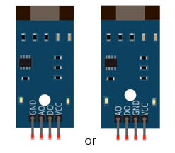
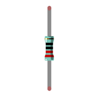
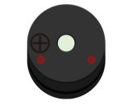
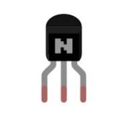
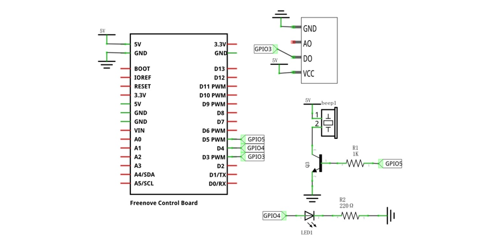
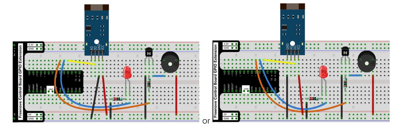

##############################################################################
Chapter U-shaped photoelectric sensor
##############################################################################

In this chapter, we will learn how to use a U-shaped photoelectric sensor.

Project U-shaped photoelectric sensor and LED
******************************************************************

This project uses a U-shaped photoelectric sensor to control the state of the LED.	

Component List
===============================

+------------------------------------------------------+
| Control board x1                                     |
|                                                      |
| |Chapter01_00|                                       |
+--------------------------+---------------------------+
| Breadboard x1            | GPIO Extension Board x1   |
|                          |                           |
| |Chapter02_00|           | |Chapter02_01|            |
+------------------+-------+---------------------------+
| USB cable x1     | Jumper x5                         |
|                  |                                   |
| |Chapter01_02|   | |Chapter01_03|                    |
+------------------+-----------------------------------+
| U-shaped photoelectric sensor x1                     |
|                                                      |
| |Chapter31_00|                                       |
+-------------------+----------------------------------+
| LED x1            |      Resistor 220Ω x1            |
|                   |                                  |
| |Chapter29_01|    |   |Chapter29_02|                 |
+-------------------+----------------------------------+        

.. |Chapter01_00| image:: ../_static/imgs/1_LED_Blink/Chapter01_00.png
.. |Chapter01_02| image:: ../_static/imgs/1_LED_Blink/Chapter01_02.png
.. |Chapter01_03| image:: ../_static/imgs/1_LED_Blink/Chapter01_03.png
.. |Chapter02_00| image:: ../_static/imgs/2_Two_LEDs_Blink/Chapter02_00.png
.. |Chapter02_01| image:: ../_static/imgs/2_Two_LEDs_Blink/Chapter02_01.png

.. |Chapter29_01| image:: ../_static/imgs/29_High-sensitivity_microphone_sensor/Chapter29_01.png  
.. |Chapter29_02| image:: ../_static/imgs/29_High-sensitivity_microphone_sensor/Chapter29_02.png  

Component knowledge
============================

U-shaped photoelectric sensor
-------------------------------------

The U-shaped photoelectric sensor is a through-beam photoelectric sensor, which consists of a transmitting end and a receiving end. Its working principle is blocking and conducting the infrared emission light will change the current induced by the infrared receiving tube. 

This module has 4 pins: digital output (DO), analog output (AO), power supply positive pin and power supply negative pin. When the positive and negative pins of the module are connected to a suitable power supply, the module starts to work. Only one pin on the development board is needed to read the digital output (DO) signal of the module. When the photoelectric sensor is blocked, the digital signal pin outputs a low level. If the photoelectric sensor is not blocked, it outputs a high level.

Below is the pinout of the touch sensor.

Pin description:
-------------------------------

+--------+------------------------------------------+
| symbol |                 Function                 |
+========+==========================================+
| VCC    | Power supply pin, +3.3V~5.5V             |
+--------+------------------------------------------+
| DO     | Output control signal(High or low level) |
+--------+------------------------------------------+
| AO     | Output invalid                           |
+--------+------------------------------------------+
| GND    | GND                                      |
+--------+------------------------------------------+

:red:`Please do not use the voltage beyond the power supply range to avoid damage to the U-shaped photoelectric sensor.`

:red:`The difference between the above two U-type photoelectric sensors is that in addition to the different pin sequence, the output signal is opposite when you block it, that is, there are modules that output high level and low level U-type photoelectric sensor. The specific module is subject to the one in your hand. Please check the pin sequence of your U-shaped photoelectric sensor and replace the appropriate wiring to avoid permanent damage to your Control Board.`

Circuit
========================

.. list-table:: 
   :width: 100%
   :align: center

   * -  Schematic diagram
   * -  |Chapter30_01|
   * -  Hardware connection 
     
        If you need any support, please feel free to contact us via: support@freenove.com

   * -  |Chapter30_02|

.. |Chapter30_01| image:: ../_static/imgs/30_Touch_Sensor_TTP223/Chapter30_01.png
.. |Chapter30_02| image:: ../_static/imgs/30_Touch_Sensor_TTP223/Chapter30_02.png

:red:`Please check the pin sequence of your sensor, and connect the circuit accordingly to avoid irrevisible damage to the board.`

Sketch
=========================

Sketch U_shaped_photoelectric_sensor_and_LED
-------------------------

When you use the module whose output signal is low level, after the program is executed, when the photoelectric sensor is blocked, the LED lights up, when the photoelectric sensor is not blocked, the LED turns off.

When you use the module with high output signal, the LED will be off when the photoelectric sensor is blocked and on when the photoelectric sensor is not blocked after the program is executed.

The phenomena are opposite, depending on the module in your hand.

The following is the program code:

.. literalinclude:: ../../../freenove_Kit/Sketches/Sketch_31.1.1_U_shaped_photoelectric_sensor_and_LED/Sketch_31.1.1_U_shaped_photoelectric_sensor_and_LED.ino
    :linenos: 
    :language: c
    :lines: 1-27
    :dedent:

Project U-shaped photoelectric sensor and buzzer
**************************************************************

This project uses U-shaped photoelectric sensor to make a simple sound and light alarm. 

Component List
=================================

+-------------------------------------------------------------+
| Control board x1                                            |
|                                                             |
| |Chapter01_00|                                              |
+--------------------------+----------------------------------+
| Breadboard x1            | GPIO Extension Board x1          |
|                          |                                  |
| |Chapter02_00|           | |Chapter02_01|                   |
+------------------+-------+----------------------------------+
| USB cable x1     | Jumper x8                                |
|                  |                                          |
| |Chapter01_02|   | |Chapter01_03|                           |
+------------------+------------------------------------------+
| U-shaped photoelectric sensor x1                            |
|                                                             |
| |Chapter31_00|                                              |
+-------------------+-----------------------------------------+
| LED x1            |  Resistor 220Ω x1                       |
|                   |                                         |
| |Chapter29_01|    |   |Chapter29_02|                        |
+-------------------+-------------------+---------------------+        
| Active buzzer x1  | NPN transistorx1  | Resistor 1kΩx1      |
|                   |                   |                     |
|                   | (S8050)           |                     |
|                   |                   |                     |
| |Chapter31_02|    |   |Chapter31_03|  |  |Chapter10_10|     |
+-------------------+-------------------+---------------------+ 

.. |Chapter24_01| image:: ../_static/imgs/24_Vibration_Switch/Chapter24_01.png
.. |Chapter10_10| image:: ../_static/imgs/10_Buzzer/Chapter10_10.png

Circuit
=============================

.. list-table:: 
   :width: 100%
   :align: center

   * -  Schematic diagram
   * -  |Chapter31_05|
   * -  Hardware connection 
     
        If you need any support, please feel free to contact us via: support@freenove.com

   * -  |Chapter31_06|

:red:`Please check the pin sequence of your sensor, and connect the circuit accordingly to avoid irrevisible damage to the board.`

Sketch
===============================

Sketch U_shaped_photoelectric_sensor_and_buzzer
-------------------------------

After the program is executed, every time the U-shaped photoelectric sensor is blocked by hand, the buzzer will sound an alarm, and the LED will flash to remind.

The following is the program code:

.. literalinclude:: ../../../freenove_Kit/Sketches/Sketch_31.2.1_U_shaped_photoelectric_sensor_and_buzzer/Sketch_31.2.1_U_shaped_photoelectric_sensor_and_buzzer.ino
    :linenos: 
    :language: c
    :lines: 1-36
    :dedent:

The attachInterrupt() function associates the sensor pins with sensorEven().Because there are high level triggering module and low level triggering module in the U-type photoelectric sensor, we use the double-edge detection method here to make the program compatible with the module in your hand. When sensorPin detects low level or high level, it will call and execute the sensorEven() function.

.. code-block:: c

    attachInterrupt(sensorPin, sensorEven, CHANGE);
    ...
    void sensorEven(void) {
        alarm(3);
    }

The function alarm() is used to control the active buzzer to emit an alarm sound and control the LED to flash at the same time. Use variable times to pass in the number of times the alarm sounds and the LED blinks.

.. literalinclude:: ../../../freenove_Kit/Sketches/Sketch_31.2.1_U_shaped_photoelectric_sensor_and_buzzer/Sketch_31.2.1_U_shaped_photoelectric_sensor_and_buzzer.ino
    :linenos: 
    :language: c
    :lines: 19-28
    :dedent:

.. py:function:: void attachInterrupt(pin_size_t pinNumber, voidFuncPtr func, PinStatus mode);	

    This is an interrupt detection function. The first parameter specifies the IO port to detect. The second parameter specifies the trigger method to detect. The third parameter specifies the function name. The function will be executed when the specified action is detected.

    The following are common detection triggers: 

    **FALLING:** falling edge trigger 

    **RISING:** rising edge trigger 

    **CHANGE:** triggers both up and down

The pins that support the attachInterrupt() function on this control board are 2 and 3. For more details,you may refer to :

`attatachInterrupt() En |Arduino Document <https://docs.arduino.cc/language-reference/en/functions/external-interrupts/attachInterrupt/#digital-pins-with-interrupts>`_