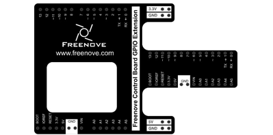

##############################################################################
Chapter 33 Hall sensor
##############################################################################

In this chapter, we will learn how to use Hall sensor.

Project Hall sensor and LED
****************************************

This project uses hall sensor to control the state of LED.

Component List
=============================

+------------------------------------------------------+
| Control board x1                                     |
|                                                      |
| |Chapter01_00|                                       |
+--------------------------+---------------------------+
| Breadboard x1            | GPIO Extension Board x1   |
|                          |                           |
| |Chapter02_00|           | |Chapter02_01|            |
+--------------------------+---------------------------+
|  Jumper x5                                           |
|                                                      |
|  |Chapter01_03|                                      |
+-------------------+----------------------------------+
| Hall sensor x1    |  Speaker x1                      |
|                   |                                  |
| |Chapter33_00|    |   |Chapter33_01|                 |
+-------------------+----------------------------------+
| LED x1            |  Resistor 220Ω x1                |
|                   |                                  |
| |Chapter29_01|    |   |Chapter29_02|                 |
+-------------------+----------------------------------+        

.. |Chapter01_00| image:: ../_static/imgs/1_LED_Blink/Chapter01_00.png
.. |Chapter01_02| image:: ../_static/imgs/1_LED_Blink/Chapter01_02.png
.. |Chapter01_03| image:: ../_static/imgs/1_LED_Blink/Chapter01_03.png
.. |Chapter02_00| image:: ../_static/imgs/2_Two_LEDs_Blink/Chapter02_00.png

.. |Chapter29_01| image:: ../_static/imgs/29_High-sensitivity_microphone_sensor/Chapter29_01.png  
.. |Chapter29_02| image:: ../_static/imgs/29_High-sensitivity_microphone_sensor/Chapter29_02.png  

Component knowledge
===============================

Hall sensor
----------------------------

Hall sensor is a magnetic field sensor made according to the Hall effect. Based on the Hall effect, Hall voltage varies with magnetic field strength. Hall sensors can be divided into linear (analog) Hall sensors and switching Hall sensors. Linear Hall sensors have two outputs: analog output (AO), digital output (DO). Switching Hall sensors only have digital output (DO) and the analog output (AO) output has no effect. In this project, the switch Hall sensor is used. Its use is very simple. 

This module has 4 pins: digital output (DO), analog output (AO), power supply positive pin and power supply negative pin. When the positive and negative pins of the module are connected to a suitable power supply, the module starts to work. Only one pin on the development board is needed to read the digital output (DO) signal of the module. In the project, the speaker is used as the magnetic field source, when you put the sensor close to the magnetic field (speaker), the DO outputs low level, and if the sensor does not sense the magnetic field (speaker), the DO outputs high level.

Below is the pinout of the Hall sensor.

:orange:`description:`

+--------+------------------------------+
| symbol |           Function           |
+========+==============================+
| VCC    | Power supply pin, +3.3V~5.5V |
+--------+------------------------------+
| DO     | Output control signal        |
+--------+------------------------------+
| AO     | Output invalid               |
+--------+------------------------------+
| GND    | GND                          |
+--------+------------------------------+

:red:`Please do not use voltage beyond the power supply range to avoid damage to the Hall sensor.`

:red:`For the above two hall sensors, their difference is only the pin sequence is different, please get the Hall sensor, check its sequence, change the corresponding wiring, so as not to cause permanent damage to your control board.`

Circuit
========================

.. list-table:: 
   :width: 100%
   :align: center

   * -  Schematic diagram
   * -  |Chapter33_02|
   * -  Hardware connection 
     
        If you need any support, please feel free to contact us via: support@freenove.com

   * -  |Chapter33_03|

:red:`Please check the sequence of your Hall sensor and select the appropriate wiring to avoid permanent damage to your raspberry PI.`

If you have a magnet you can try to put the magnet close to the Hall sensor, since there are magnets inside the speaker, in this experiment we use the speaker to carry out the experiment.

Sketch
==========================

Sketch HallSensor
---------------------------

After the program is executed, when the sensor is close to the magnetic field (horn) by hand, the LED will turn on, and if the sensor does not sense the magnetic field (horn), the LED will turn off.

The following is the program code:

.. literalinclude:: ../../../freenove_Kit/Sketches/Sketch_33.1.1_HallSensor/Sketch_33.1.1_HallSensor.ino
    :linenos: 
    :language: c
    :lines: 1-26
    :dedent:

Project Hall Sensor and Buzzer
********************************************

This project uses Hall sensor to make a simple magnetic field detection sound and light alarm.

Component List
===============================

+-----------------------------------------------------------------+
| Control board x1                                                |
|                                                                 |
| |Chapter01_00|                                                  |
+--------------------------+--------------------------------------+
| Breadboard x1            | GPIO Extension Board x1              |
|                          |                                      |
| |Chapter02_00|           | |Chapter02_01|                       |
+--------------------------+--------------------------------------+
|  Jumper x5                                                      |
|                                                                 |
|  |Chapter01_03|                                                 |
+-------------------+---------------------------------------------+
| Hall sensor x1    |  Speaker x1                                 |
|                   |                                             |
| |Chapter33_00|    |   |Chapter33_01|                            |
+-------------------+---------------------------------------------+
| LED x1            |  Resistor 220Ω x1                           |
|                   |                                             |
| |Chapter29_01|    |   |Chapter29_02|                            |
+-------------------+---------------------+-----------------------+   
| NPN transistorx1  |  Resistor 1kΩ x1    |  Active buzzer x1     |
|                   |                     |                       |
| (S8050)           |                     |                       |
|                   |                     |                       |
| |Chapter33_04|    |   |Chapter33_05|    |  |Chapter33_06|       |
+-------------------+---------------------+-----------------------+   

:red:`For the above two hall sensors, their difference is only the pin sequence is different, please get the Hall sensor, check its sequence, change the corresponding wiring, so as not to cause permanent damage to your control board.`

Circuit
=====================================

.. list-table:: 
   :width: 100%
   :align: center

   * -  Schematic diagram
   * -  |Chapter33_07|
   * -  Hardware connection 
     
        If you need any support, please feel free to contact us via: support@freenove.com

   * -  |Chapter33_08|

:red:`Please check the sequence of your Hall sensor and select the appropriate wiring to avoid permanent damage to your control board.`

Sketch
====================================

Sketch Alertor
---------------------------------------

After the program is executed, every time the sensor is close to the magnetic field (speaker) by hand, the buzzer will sound an alarm, and the LED will flash to remind.

The following is the program code:

.. literalinclude:: ../../../freenove_Kit/Sketches/Sketch_33.2.1_Alertor/Sketch_33.2.1_Alertor.ino
    :linenos: 
    :language: c
    :lines: 1-36
    :dedent:
