##############################################################################
Chapter LEDpixel
##############################################################################

This chapter will help you learn to use a more convenient RGB LED lamp, which requires only one GPIO

control and can be connected in infinite series in theory. Each LED can be controlled independently.

Project LEDpixel
*******************************

Learn the basic usage of LEDPixel and use it to flash red, green, blue and white.

Component List
============================

+------------------------------------------------------+
| Control board x1                                     |
|                                                      |
| |Chapter01_00|                                       |
+--------------------------+---------------------------+
| Breadboard x1            | GPIO Extension Board x1   |
|                          |                           |
| |Chapter02_00|           | |Chapter02_01|            |
+------------------+-------+---------------------------+
| USB cable x1     | Jumper M/M x3                     |
|                  |                                   |
| |Chapter01_02|   | |Chapter01_03|                    |
+------------------+-----------------------------------+
| Freenove 8 RGB LED Module x1                         |
|                                                      |
| |Chapter35_00|                                       |
+------------------------------------------------------+

.. |Chapter01_00| image:: ../_static/imgs/1_LED_Blink/Chapter01_00.png
.. |Chapter01_02| image:: ../_static/imgs/1_LED_Blink/Chapter01_02.png
.. |Chapter01_03| image:: ../_static/imgs/1_LED_Blink/Chapter01_03.png
.. |Chapter02_00| image:: ../_static/imgs/2_Two_LEDs_Blink/Chapter02_00.png
.. |Chapter02_01| image:: ../_static/imgs/2_Two_LEDs_Blink/Chapter02_01.png
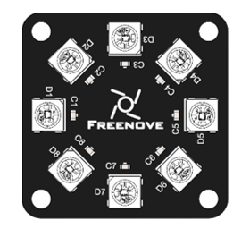

Component knowledge
================================

Freenove 8 RGB LED Module
--------------------------------

The Freenove 8 RGB LED Module is as below.

It consists of 8 WS2812, each of which requires only one pin to control and supports cascade. Each WS212

has integrated 3 LEDs, red, green and blue respectively, and each of them supports 256-level brightness

adjustment, which means that each WS2812 can emit 2^24=16,777,216 different colors.

You can use only one data pin to control eight LEDs on the module. As shown below:

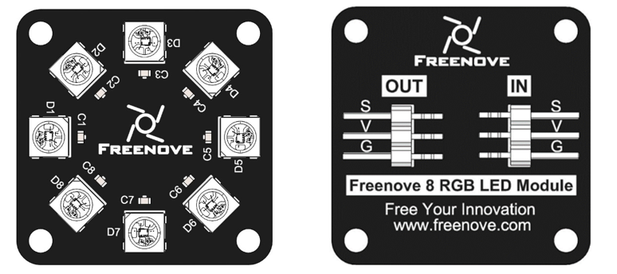

And you can also control many modules at the same time. Just connect OUT pin of one module to IN pin of another module. In such way, you can use one data pin to control 8, 16, 32 ... LEDs.

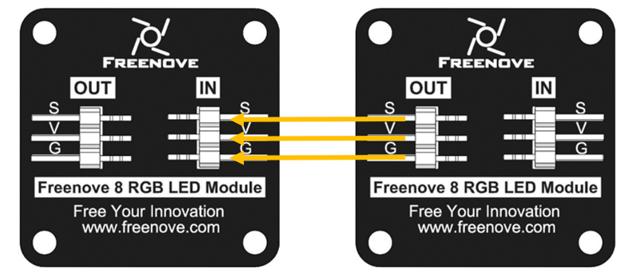

:orange:`description:`

+---------------------------------------+---------------------------------------+
|(IN)	                                | (OUT)                                 |
+========+==============================+========+==============================+
| symbol |           Function           | symbol |           Function           |
+--------+------------------------------+--------+------------------------------+
| S      | Input control signal         | S      | Output control signal        |
+--------+------------------------------+--------+------------------------------+
| V      | Power supply pin, +3.5V~5.5V | V      | Power supply pin, +3.5V~5.5V |
+--------+------------------------------+--------+------------------------------+
| G      | GND                          | G      | GND                          |
+--------+------------------------------+--------+------------------------------+

Circuit
============================

.. list-table:: 
   :width: 100%
   :align: center

   * -  Schematic diagram
   * -  |Chapter35_03|
   * -  Hardware connection 
     
        If you need any support, please feel free to contact us via: support@freenove.com

   * -  |Chapter35_04|

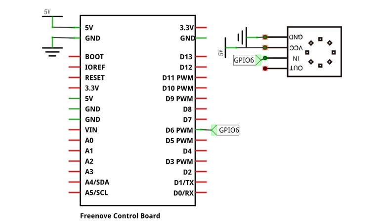
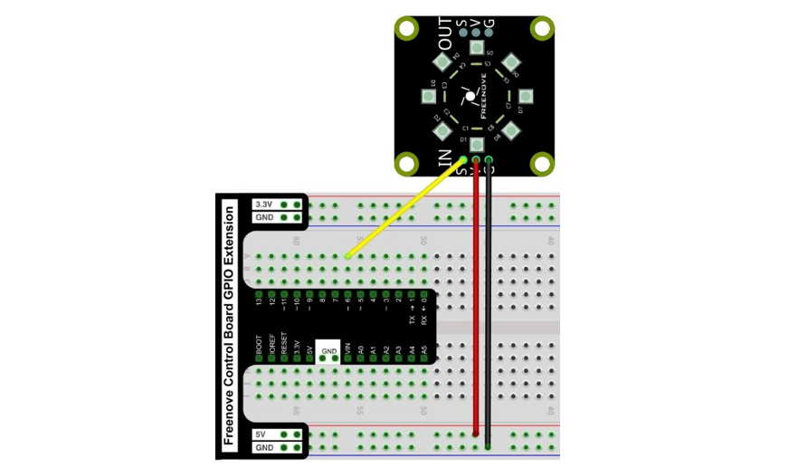

Sketch
===========================

This code uses a library named "FastLED", if you have not installed it, please do so first.

Library is an important feature of the open source world, and we know that Arduino is an open source platform

that everyone can contribute to.

How to install the library
---------------------------------

There are two ways to add libraries.

The first way, open the Arduino IDE, click Tools Manager Libraries.

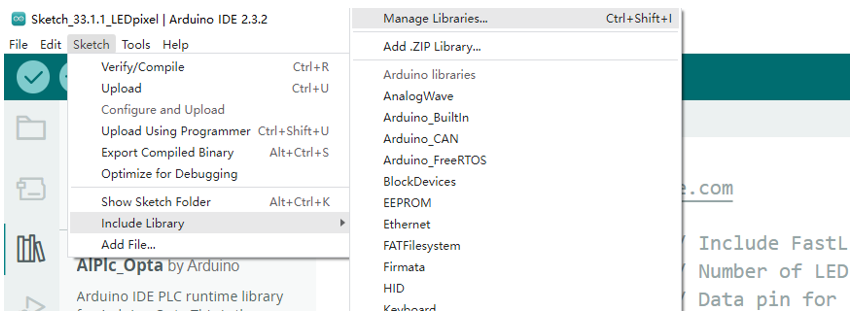

In the pop-up window, Library Manager, search for the name of the Library, "FastLED". Then click Install.

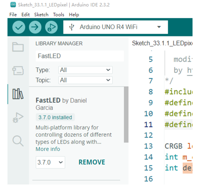

Or, you can search "FastLED" in library manager to install.

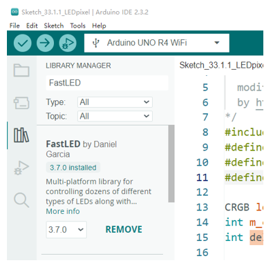

The second way, open Arduino IDE, click SketchInclude LibraryAdd .ZIP Library, In the pop-up window, find the file named "./Libraries/ FastLED.Zip" which locates in this directory, and click OPEN.

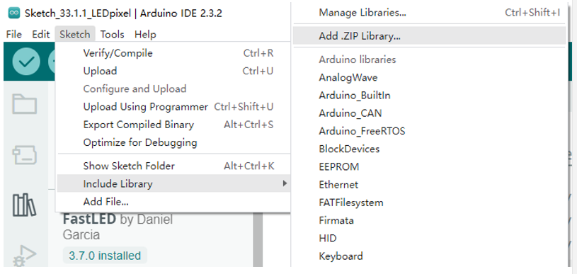

Sketch LEDpixel
---------------------------

Download the code to Control Board and RGB LED begins to light up in red, green, blue, white and black.

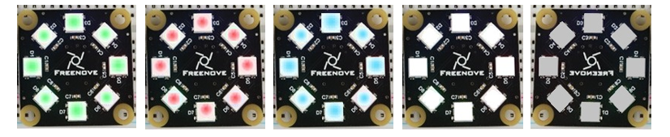

The following is the program code:

.. literalinclude:: ../../../freenove_Kit/Sketches/Sketch_35.1.1_LEDpixel/Sketch_35.1.1_LEDpixel.ino
    :linenos: 
    :language: c
    :lines: 1-33
    :dedent:

To use some libraries, first you need to include the library's header file.

.. literalinclude:: ../../../freenove_Kit/Sketches/Sketch_35.1.1_LEDpixel/Sketch_35.1.1_LEDpixel.ino
    :linenos: 
    :language: c
    :lines: 8-8
    :dedent:

Define the pins connected to the ring, the number of LEDs on the ring.

.. literalinclude:: ../../../freenove_Kit/Sketches/Sketch_35.1.1_LEDpixel/Sketch_35.1.1_LEDpixel.ino
    :linenos: 
    :language: c
    :lines: 9-10
    :dedent:

Define the color values to be used, as red, green, blue, white, and black.

.. literalinclude:: ../../../freenove_Kit/Sketches/Sketch_35.1.1_LEDpixel/Sketch_35.1.1_LEDpixel.ino
    :linenos: 
    :language: c
    :lines: 14-14
    :dedent:

Define a variable to set the time interval for each led to light up. The smaller the value is, the faster it will light up.

.. literalinclude:: ../../../freenove_Kit/Sketches/Sketch_35.1.1_LEDpixel/Sketch_35.1.1_LEDpixel.ino
    :linenos: 
    :language: c
    :lines: 15-15
    :dedent:

Initialize strip() in setup() and set the brightness.

.. literalinclude:: ../../../freenove_Kit/Sketches/Sketch_35.1.1_LEDpixel/Sketch_35.1.1_LEDpixel.ino
    :linenos: 
    :language: c
    :lines: 18-19
    :dedent:

In the loop(), there are two "for" loops, the internal for loop to light the LED one by one, and the external for loop to switch colors. leds[dot] is used to set the color, but it does not change immediately. Only when FastLED.show() is called will the color data be sent to the LED to change the color.

.. literalinclude:: ../../../freenove_Kit/Sketches/Sketch_35.1.1_LEDpixel/Sketch_35.1.1_LEDpixel.ino
    :linenos: 
    :language: c
    :lines: 24-32
    :dedent:

Project RainbowLight 
*********************************

In the previous project, we have mastered the use of LEDPixel. This project will realize a slightly complicated rainbow light. The component list and the circuit are exactly the same as the project fashionable light.

Component List
==========================

+------------------------------------------------------+
| Control board x1                                     |
|                                                      |
| |Chapter01_00|                                       |
+--------------------------+---------------------------+
| Breadboard x1            | GPIO Extension Board x1   |
|                          |                           |
| |Chapter02_00|           | |Chapter02_01|            |
+------------------+-------+---------------------------+
| USB cable x1     | Jumper M/M x3                     |
|                  |                                   |
| |Chapter01_02|   | |Chapter01_03|                    |
+------------------+-----------------------------------+
| Freenove 8 RGB LED Module x1                         |
|                                                      |
| |Chapter35_00|                                       |
+------------------------------------------------------+

Circuit
============================

.. list-table:: 
   :width: 100%
   :align: center

   * -  Schematic diagram
   * -  |Chapter35_10|
   * -  Hardware connection 
     
        If you need any support, please feel free to contact us via: support@freenove.com

   * -  |Chapter35_11|

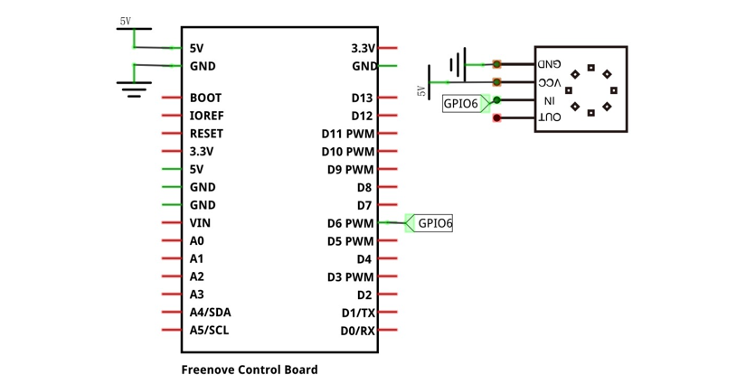
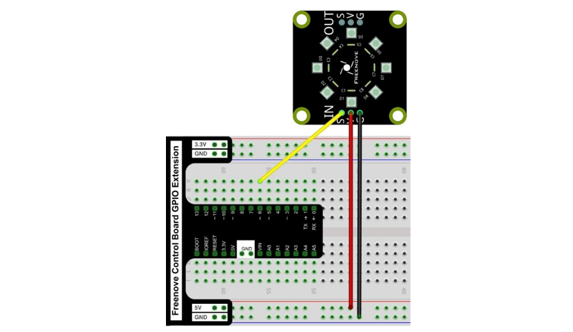

Sketch
===========================

Continue to use the following color model to equalize the color distribution of the 8 LEDs and gradually change. 

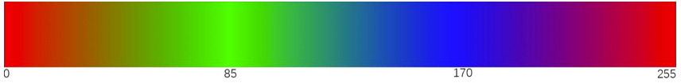

Sketch RainbowLight
----------------------------

Download the code to ESP32-WROVER and RGB LED begins to light up in red, green, blue, white and black.

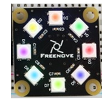

The following is the program code:

.. literalinclude:: ../../../freenove_Kit/Sketches/Sketch_35.2.1_RainbowLight/Sketch_35.2.1_RainbowLight.ino
    :linenos: 
    :language: c
    :lines: 1-53
    :dedent:

In the loop(), two "for" loops are used, the internal "for" loop(for-j) is used to set the color of each LED, and the external "for" loop(for-i) is used to change the color, in which the self-increment value in i+=1 can be changed to change the color step distance. Changing the delay parameter changes the speed of the color change. Wheel(i * 256 / LEDS_COUNT + j) & 255) will take color from the color model at equal intervals starting from i.

.. literalinclude:: ../../../freenove_Kit/Sketches/Sketch_35.2.1_RainbowLight/Sketch_35.2.1_RainbowLight.ino
    :linenos: 
    :language: c
    :lines: 24-31
    :dedent: