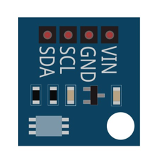
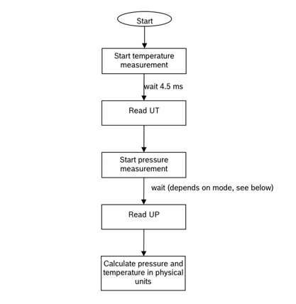
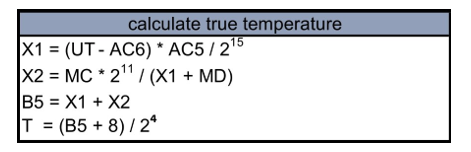
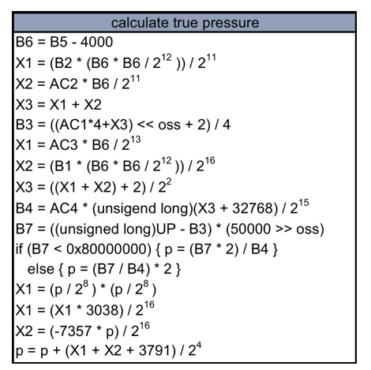
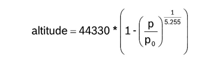
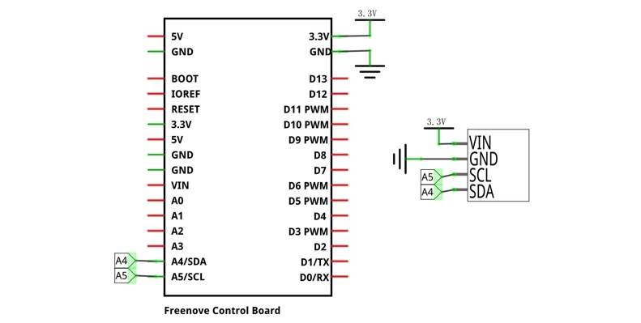
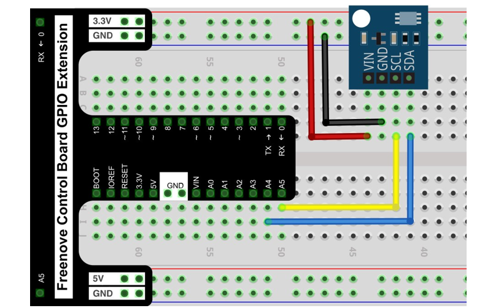

##############################################################################
Chapter BMP180 Barometric Pressure Sensor
##############################################################################

In this chapter, we will learn how to use BMP180 barometric pressure sensor.

Project Barometer
************************************

This project uses the BMP180 barometric pressure sensor to display real-time barometric pressure, temperature conditions and current altitude.

Component List
==============================

+------------------------------------------------------+
| Control board x1                                     |
|                                                      |
| |Chapter01_00|                                       |
+--------------------------+---------------------------+
| Breadboard x1            | GPIO Extension Board x1   |
|                          |                           |
| |Chapter02_00|           | |Chapter02_01|            |
+------------------+-------+---------------------------+
| USB cable x1     | Jumper M/M x3                     |
|                  |                                   |
| |Chapter01_02|   | |Chapter01_03|                    |
+------------------+-----------------------------------+
| BMP180 barometric pressure sensor x1                 |
|                                                      |
| |Chapter36_00|                                       |
+------------------------------------------------------+

.. |Chapter01_00| image:: ../_static/imgs/1_LED_Blink/Chapter01_00.png
.. |Chapter01_02| image:: ../_static/imgs/1_LED_Blink/Chapter01_02.png
.. |Chapter01_03| image:: ../_static/imgs/1_LED_Blink/Chapter01_03.png
.. |Chapter02_00| image:: ../_static/imgs/2_Two_LEDs_Blink/Chapter02_00.png
.. |Chapter02_01| image:: ../_static/imgs/2_Two_LEDs_Blink/Chapter02_01.png

Component knowledge
================================

BMP180 barometric pressure sensor
---------------------------------------

The BMP180 barometric pressure sensor module is a high-precision barometric pressure sensor, which can detect temperature and barometric pressure, and through these two data, the current altitude can be calculated. Its pressure measurement range is from 300 to 1100 hPa (altitude 9000m to -500m), and temperature from -40°C to 85°C with an accuracy of ±1.0°C. Using the BMP180 module to get altitude and barometric pressure requires math.

The BMP180 is designed to connect directly to the microcontroller via the IIC bus. The pressure and temperature data must be compensated by the BMP180's E2PROM calibration data. The BMP180 consists of a piezoresistive sensor, an analog-to-digital converter and a control unit with E2PROM and serial IIC interface. The BMP180 provides uncompensated pressure and temperature values. The E2PROM stores 176 bits of individual calibration data, which is used to compensate sensor for offset, temperature dependence and other parameters.

The general process of BMP180 reading data and the calculation of each data are as follows:

Among them, UT is temperature data (16 bits), and UP is pressure data (16 to 19 bits).

Calculate temperature:

Calculate pressure:

Calculate absolute altitude. According to the measured air pressure p and sea level air pressure po (for example, 1013.25hPa), the altitude in meters can be calculated via the following international pressure formula:

Below is the pinout of BMP180 barometric pressure sensor.

:orange:`Pin description:`

+--------+-----------------------------------+
| symbol |             Function              |
+========+===================================+
| VIN    | Power supply pin, +1.6V~3.6V      |
+--------+-----------------------------------+
| GND    | GND                               |
+--------+-----------------------------------+
| SCL    | Serial clock pin of I2C interface |
+--------+-----------------------------------+
| SDA    | Serial data pin of I2C interface  |
+--------+-----------------------------------+

Please do not use voltage beyond the power supply range to avoid damage to the BMP180 barometric pressure sensor.

Circuit
============================

.. list-table:: 
   :width: 100%
   :align: center

   * -  Schematic diagram
   * -  |Chapter36_05|
   * -  Hardware connection 
     
        If you need any support, please feel free to contact us via: support@freenove.com

   * -  |Chapter36_06|

Sketch
=======================

Sketch Barometer
-------------------------

After the program is executed, the terminal will display the current air pressure value, temperature value and altitude.

The following is the program code:

.. literalinclude:: ../../../freenove_Kit/Sketches/Sketch_36.1.1_Barometer/Sketch_36.1.1_Barometer.ino
    :linenos: 
    :language: c
    :lines: 1-49
    :dedent:

Intialize the BMP180 sensor.

.. literalinclude:: ../../../freenove_Kit/Sketches/Sketch_36.1.1_Barometer/Sketch_36.1.1_Barometer.ino
    :linenos: 
    :language: c
    :lines: 14-17
    :dedent:

Read various data of the BMP180 sensor and print them out through the serial port.

.. literalinclude:: ../../../freenove_Kit/Sketches/Sketch_36.1.1_Barometer/Sketch_36.1.1_Barometer.ino
    :linenos: 
    :language: c
    :lines: 21-48
    :dedent: