##############################################################################
Chapter Soldering Circuit Board
##############################################################################

From previous chapters, we have learned about electronic circuits and components and have built a variety of circuits using a Breadboard device, which is not designed to be used permanently. We now will take a further step to make permanent projects using a Perfboard (a type of Prototype Circuit Board). Note: Perfboard is a stiff, thin sheet of insulated material with holes bored on a grid. The grid is usually a squared off shape with a spacing of 0.1 inches. Square copper pads cover these holes to make soldering electronic components easier. 

To finish this chapter, you need to prepare the necessary soldering equipment, including an electric soldering iron (or soldering pencil) and solder. We have already prepared the Perfboard for you. 

CAUTION: Please use extreme caution and attention to safety when you operate soldering tools used in these projects.

Project Solder a Buzzer
****************************************

You should be familiar with the Buzzer from our previous project. We will solder a permanent circuit that when a Push Button Switch is pressed a Buzzer sounds

.. note::
    
    This circuit does not require programming and will work when it is powered ON. When the button is not pressed and the Buzzer is not in use, there is no power consumption.

You can install it on your bicycle, your bedroom door or any other place where you want a Buzzer.

Component List
====================================

.. list-table:: 
   :width: 100%
   :align: center

   * -  Pin header x2
     -  LED x1
     -  Resistor 220Ω x1
     -  Active buzzer x1
     -  Push button x1
   
   * -  |Chapter43_00|
     -  |Chapter43_01|
     -  |Chapter43_02|
     -  |Chapter43_03|
     -  |Chapter43_04|

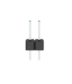
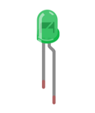

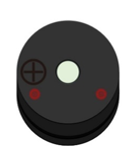
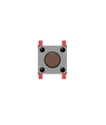

Circuit
==============================

We will solder the following circuit on the Perfboard.

.. list-table:: 
   :width: 100%
   :align: center

   * -  Schematic diagram
     -  Hardware connection
   
   * -  |Chapter43_05|
     -  |Chapter43_06|

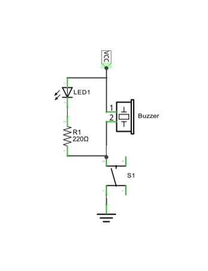
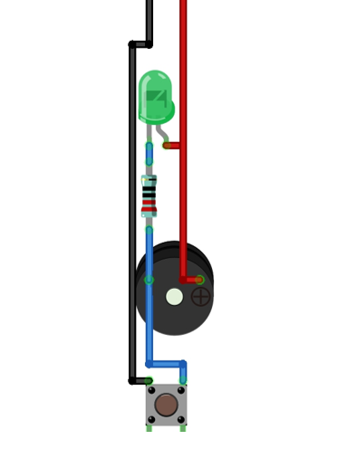

.. note::
    
    If you are new to soldering electronic components on any type of circuit board we strongly recommend that you watch some instructional How-To videos by doing an Internet search and practice your soldering technique before attempting to solder the following projects. Some components can be damaged by exposure to excessive heat for prolonged times and there are various techniques you can learn that will help with making neater solder joints.

Solder the Circuit 
================================

Insert the components in the Perfboard following the Hardware Connection image as a general visual guide. Insert the pins of the components (all from the same side) so that you have only the components on one side of the Perfboard and the pins on the other. Then from the side with the pins carefully solder the circuit on the backside without having excess solder shorting out any portions of the circuit.

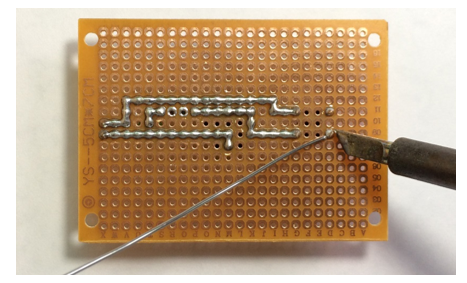

Here is a diagram after soldering from both sides of the Perfboard:

.. list-table:: 
   :width: 100%
   :align: center

   * -  Front
     -  Back
   
   * -  |Chapter43_08|
     -  |Chapter43_09|

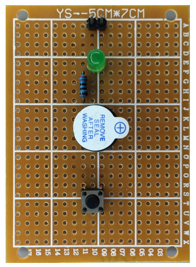
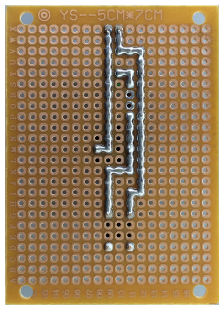

Test Circuit
===========================

Connect the circuit board to power supply (3~5V). You can use control board or battery box as the power supply.

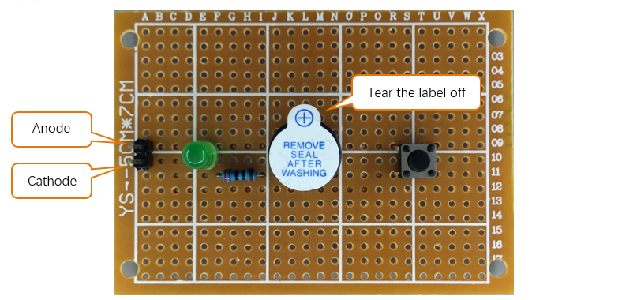

Press the push button switch after connecting the power, and then the buzzer will sound.     

Project Solder a Flowing Water Light 
*************************************************

You should be familiar with the Flowing Water Light from our previous project. We will solder a permanent circuit using improved code to make a more interesting Flowing Water Light.

Component List
=============================

.. list-table:: 
   :width: 100%
   :align: center

   * -  Pin header x5
     -  Resistor 220Ω x8
     -  LED x8
     -  74HC595 x1
   
   * -  |Chapter43_11|
     -  |Chapter43_12|
     -  |Chapter43_13|
     -  |Chapter43_14|

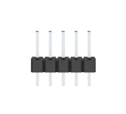
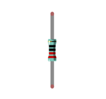
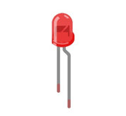
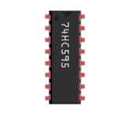

Circuit
==============================

Solder the following circuit on the Perfboard.

.. list-table:: 
   :width: 100%
   :align: center

   * -  Schematic diagram
     -  Hardware connection
   
   * -  |Chapter43_15|
     -  |Chapter43_16|

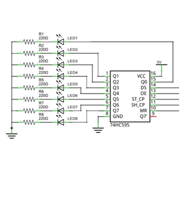
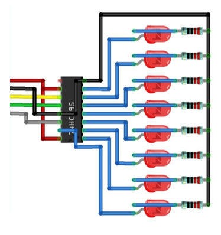

Solder the Circuit
=============================

Insert the components in the Perfboard, and solder the circuit on the back per earlier instructions. 

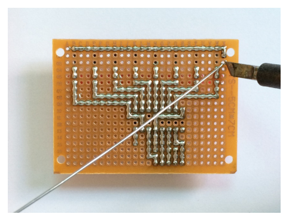

Here is a diagram after soldering from both sides of the Perfboard:

.. list-table:: 
   :width: 100%
   :align: center

   * -  Front
     -  Back
   
   * -  |Chapter43_18|
     -  |Chapter43_19|

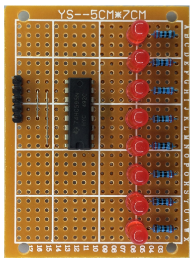
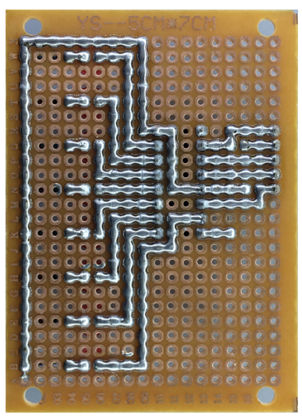

Connect the Circuit
============================

Connect the board to control board with jumper wire in the following way.

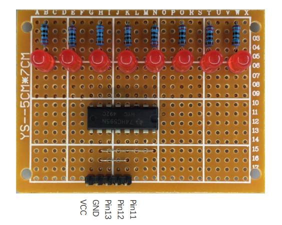

Sketch
========================

Sketch 43.2.1
------------------------

Now, let's write code to make a dropping-rain effect on our board.

.. literalinclude:: ../../../freenove_Kit/Sketches/Sketch_43.2.1_Flowing_Water_Light/Sketch_43.2.1_Flowing_Water_Light.ino
    :linenos: 
    :language: c
    :lines: 1-37
    :dedent:

First we define an array to modulate different PWM pulse widths for LEDs, in doing so different LEDs can emit varied brightness. Starting from the array index 0, take an array of 8 adjacent numbers as the LED duty cycle and output it one at a time. Increasing the starting index number in turn, then it will create a flowing effect.

.. literalinclude:: ../../../freenove_Kit/Sketches/Sketch_43.2.1_Flowing_Water_Light/Sketch_43.2.1_Flowing_Water_Light.ino
    :linenos: 
    :language: c
    :lines: 21-21
    :dedent:

Define a variable to select 8 adjacent numbers in an array in turn.

.. literalinclude:: ../../../freenove_Kit/Sketches/Sketch_43.2.1_Flowing_Water_Light/Sketch_43.2.1_Flowing_Water_Light.ino
    :linenos: 
    :language: c
    :lines: 23-23
    :dedent:

Define a variable to control the speed of the raindrops.

.. literalinclude:: ../../../freenove_Kit/Sketches/Sketch_43.2.1_Flowing_Water_Light/Sketch_43.2.1_Flowing_Water_Light.ino
    :linenos: 
    :language: c
    :lines: 25-25
    :dedent:

Reduce the auto-increment speed of the variable offset with the following code.

.. literalinclude:: ../../../freenove_Kit/Sketches/Sketch_43.2.1_Flowing_Water_Light/Sketch_43.2.1_Flowing_Water_Light.ino
    :linenos: 
    :language: c
    :lines: 26-27
    :dedent:

We use software to output PWM waveform. Define the cycle of PWM to be 64 cycles and determine the pulse width of LED (that is brightness) according to the selected eight numbers of the array in each cycle.

.. literalinclude:: ../../../freenove_Kit/Sketches/Sketch_43.2.1_Flowing_Water_Light/Sketch_43.2.1_Flowing_Water_Light.ino
    :linenos: 
    :language: c
    :lines: 29-40
    :dedent:

Due to the change of the variable offset, the LED will output the brightness that the eight adjacent numbers represents in the array, and form the dropping-rain effect.

Verify and upload the code, and then you will see the dropping-rain effect that LED forms.