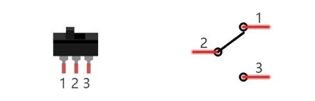
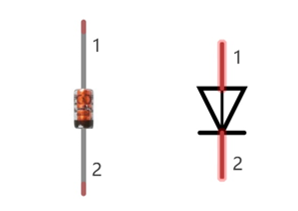
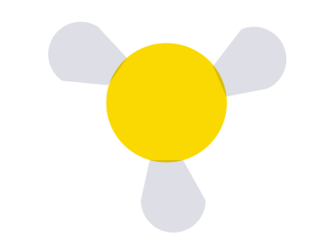
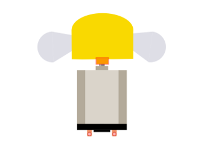
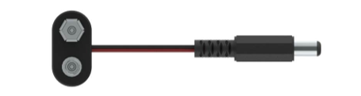
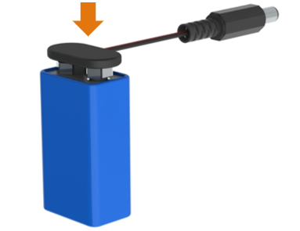

##############################################################################
Other Components
##############################################################################

This kit also includes other common components that can help your ideas come true. Now we will introduce components not mentioned in the previous section.

Component Knowledge
==============================

Toggle switch
----------------------------

Like push button switch, toggle switch is also a kind of switching devices. The difference is that toggle switch is suitable for long-time open or close circuits.

When the lever is moved to the left, pin 1, 2 get conducted, and pin 2, 3 are disconnected from each other;

When the lever is moved to the right, pin 2,3 get conducted, and pin 1,2 are disconnected from each other;

Switch diode
-------------------------------

There are several types of diodes. We have used 1N4001 before, which is a common rectifier diode and commonly used in ac rectifier.

Here is 1N4148, which is a kind of high-speed switching diodes and is characterized by a relatively rapid switching.

For the switching diode, the changing time from conduction to cut off or from cut off to conduction is shorter than general diode and it is mainly used in electronic computer, pulse and switching circuits.

Motor soft fan blade
---------------------------

This is the fan blade of the motor.

The installation of soft fan blades is as follows:

9V battery cable
----------------------------

A 9V battery cable can connect a 9 V battery, which can supply power for control board.

The installation of 9V battery cable is as follows:

